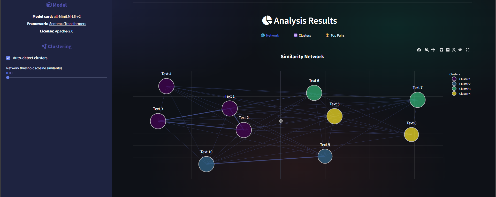

# Similyzer

Semantic textual similarity application to visualize relationships between texts (or sentences) through similarity network, clusters and pairs.



## Features

- **Similarity Network**: Force-directed graph showing text relationships based on cosine similarity
- **Clustering**: K-Means clustering with automatic cluster detection
- **Top Pairs**: The most and least similar text (or sentence) pairs
- **Metrics**: Silhouette score, Calinski-Harabasz index, within/between cluster similarity

## Model

Uses [all-MiniLM-L6-v2](https://huggingface.co/sentence-transformers/all-MiniLM-L6-v2) from [Sentence Transformers](https://www.sbert.net/). Maps sentences to a 384-dimensional dense vector space.

## How to Run

```bash
pip install -r requirements.txt
streamlit run app.py
```

## License

MIT
